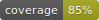

Welcome to ValveVMF's documentation!
====================================

.. image:: https://img.shields.io/badge/License-GPLv3-blue.svg
   :target: https://github.com/pySourceSDK/ValveVMF/blob/master/LICENSE.txt

.. image:: https://img.shields.io/pypi/pyversions/valvevmf.svg
   :target: https://pypi.python.org/pypi/valvevmf/

.. image:: https://badge.fury.io/py/valvevmf.svg
   :target: https://pypi.python.org/pypi/valvevmf/

ValveVMF is a Python library for parsing .vmf files for the Source Engine. It provides ways to read, modify and write vmf files as well as some utilities for basic transformations (translation, scaling, mirroring and more).

User Guides
-----------

Get yourself up and running quickly.

.. toctree::
   :maxdepth: 2

   quickstart

API
---

.. toctree::
   :maxdepth: 2

   api_ref

Contributing
------------

Few things to know before diving in the code.

.. toctree::
   :maxdepth: 2

   contributing
